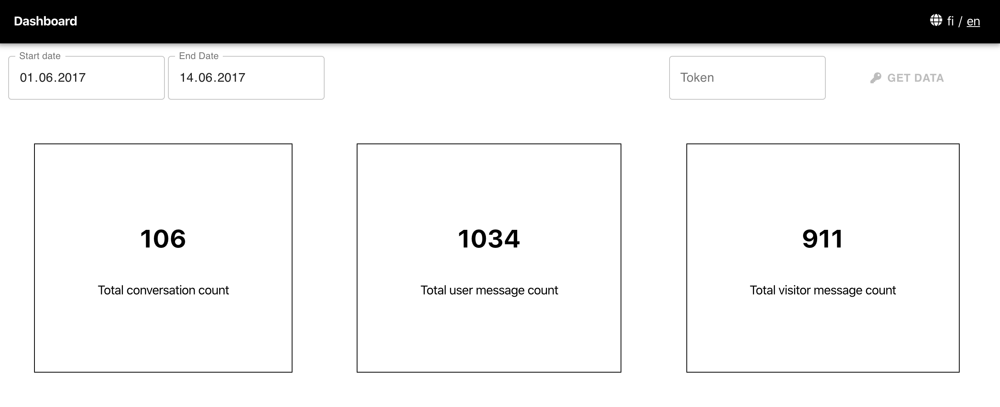

# Conversation Dashaaord

A convenience UI dashboard for cheking statistics on conversations fetched from `api.giosg.com/api/reporting`. The dashboard is build with React as an job application exercise.

Highlighted features:

- Typescript
- Axios hooks for convenient API access
- Local storage hooks for persistent selections
- Material-UI for input components and convenient table rendering
- Localization

See [the app](https://mighty-stream-08551.herokuapp.com/) in action (but give heroku a few seconds to boot the instance)!



## Further work

- Better unit testing coverage and validation tests, e.g. with jest and Robot Framework.
- Add some graphs from data

## Development

To run the app in the development mode:

`npm start`

Open [http://localhost:3000](http://localhost:3000) to view it in the browser.

To run basic rendering test:

`npm test`

## Deployment

The delpoyment to heroku requires the installation of Git and Heroku CLI:

To deploy the app run:

```
heroku create
git push heroku master
```
